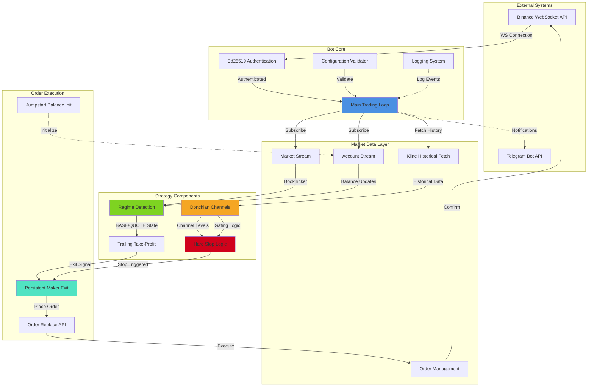
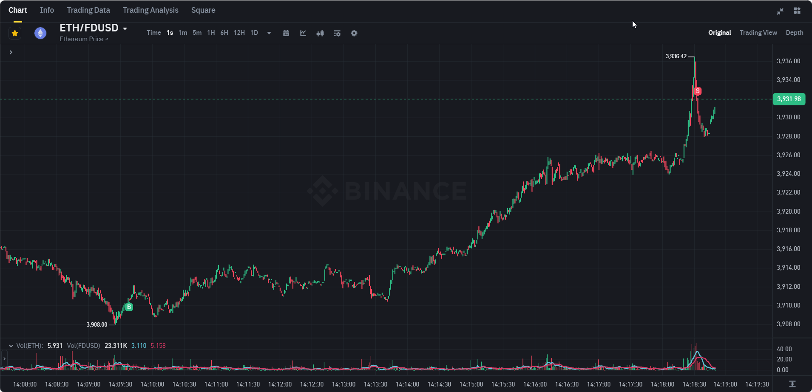
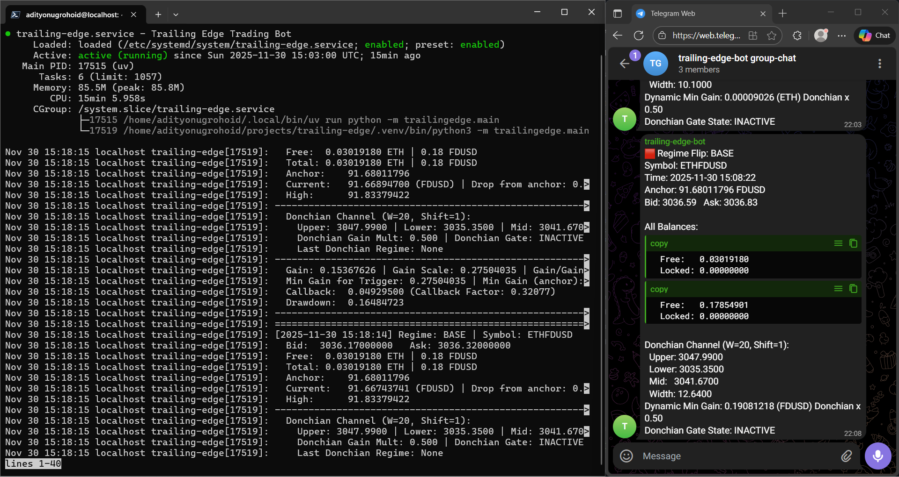

# Trailing Edge Trading Bot

[](https://github.com/adityonugrohoid/trailing-edge/actions/workflows/ci.yml)
[](https://pre-commit.com/)
[](https://docs.pytest.org/)
[](https://github.com/adityonugrohoid/trailing-edge)
[](https://www.python.org/downloads/)
[](https://github.com/astral-sh/uv)

A high-performance asynchronous Python trading bot for Binance, featuring dynamic trailing take-profit strategies, regime detection, Donchian channel gating, and Ed25519 authentication.

> **Code Quality**: Pragmatic bot script checks pass - balancing strict type checking with real-time trading requirements

**Topics**: `trading-bot` `binance` `cryptocurrency` `algorithmic-trading` `python` `asyncio` `websocket` `trailing-stop` `donchian-channels` `ed25519` `telegram-bot` `market-making` `quantitative-trading` `technical-indicators` `automated-trading`

## Table of Contents

- [System Architecture](#system-architecture)
- [Architectural Decisions](#architectural-decisions)
- [Screenshots](#screenshots)
- [Features](#features)
- [Setup](#setup)
- [Usage](#usage)
  - [Running the Bot](#running-the-bot)
  - [Production Deployment (Systemd)](#production-deployment-systemd)
  - [Running Tests](#running-tests)
- [Project Structure](#project-structure)
- [Development](#development)

## System Architecture



## Architectural Decisions

This system was engineered for **24/7 autonomous reliability** on low-cost infrastructure. The architecture prioritizes low latency and operational simplicity over microservice complexity.

### 1. Concurrency Model: `asyncio` vs. Threading
* **Decision:** Built using Python's native `asyncio` event loop rather than multi-threading.
* **Reasoning:** The workload is heavily I/O bound (waiting for WebSocket frames). Threading introduces Context Switching overhead and Race Conditions. `asyncio` allows us to handle high-frequency Market Data streams and User Data streams concurrently on a single core with sub-100ms reaction time.

### 2. Orchestration: `systemd` vs. Docker
* **Decision:** Deployed as a native `systemd` service rather than a Docker container.
* **Reasoning:** For a single-node bot, Docker adds network bridging overhead and complexity in persistence.
    * **Auto-Restart:** Configured with `Restart=always` to recover instantly from crashes.
    * **Logging:** Native integration with `journald` allows for centralized log rotation without external agents.
    * **Resource Management:** `systemd` slices set strict CPU/Memory quotas to prevent the bot from starving the host OS.

### 3. Security: Ed25519 vs. HMAC
* **Decision:** Implemented Ed25519 asymmetric key authentication.
* **Reasoning:** HMAC relies on a shared secret; if compromised, it allows full request forgery. Ed25519 uses asymmetric cryptography, signing requests with a private key that never leaves memory while the server verifies with a public key. This eliminates shared-secret risks and enables safer, non-disruptive key rotation for long-running production systems.

### 4. State Management: In-Memory vs. Database
* **Decision:** Volatile in-memory state with "Fire-and-Forget" updates.
* **Reasoning:** DB writes introduce latency. The bot is designed to be **stateless on restart** and fully event-driven. Instead of querying REST APIs (which block and hit rate limits), it rebuilds state via **WebSocket Reconciliation**: triggering an immediate push of fresh Account and Order snapshots from the User Data Stream upon connection, ensuring synchronization is instant and purely stream-based.

## Screenshots

### Kline Chart Analysis


### Live Bot Operation with Systemd and Telegram Alerts


The bot runs continuously on cloud VPS using systemd for automatic startup, restart on failure, and 24/7 operation. Real-time trade alerts and regime changes are delivered via Telegram.

## Features

### Core Architecture

- **Asynchronous Architecture** — Built on `asyncio` and `websockets` for low-latency market data processing and concurrent stream handling.

- **Secure Authentication** — Uses Ed25519 key pairs for secure, non-expiring API authentication with Binance WebSocket API.

- **Resilience** — Auto-reconnect logic for WebSocket streams with exponential backoff and configurable retry limits.

- **Cross-Platform** — Supports both Windows and Linux with native hotkey listener implementation using threading.

### Trading Strategies

- **Trailing Take-Profit** — Dynamic callback-based profit-taking with exponential decay from start to min factor. Automatically adjusts profit targets as gains increase, locking in profits while allowing room for continued upside.

- **Regime Detection and Auto-Compounding** — Automatically switches between BASE (inventory holding) and QUOTE (cash holding) modes:
  - **Fire and Forget**: Balance updates on every change via WebSocket user data stream
  - **All-In Compounding**: Perfect for bull rallies - reinvests entire portfolio each cycle
  - **No Pre-Session Balance Required**: Jumpstart orders initialize balance snapshots at startup

- **Jumpstart Balance Initialization** — Places deep out-of-market orders (+/- 10% from current price) to trigger Binance's user data stream balance snapshot:
  - **Solves Cold Start Problem**: User data stream only sends updates on balance changes
  - **Safe and Non-Intrusive**: Orders immediately cancelled after triggering snapshot
  - **Session Independence**: No need to manually track balances between restarts

- **Hard Stop with Donchian Gating** — Intelligent stop-loss system with automatic re-entry gating:
  - **Volatility-Aware**: Uses Donchian Channels (configurable window) to adapt to market conditions
  - **Re-Anchor on Stop**: Resets anchor/high values after exit for fresh cycle
  - **Regime-Specific Behavior**:
    - BASE: Flushes all inventory to cash (persistent SELL orders at best bid)
    - QUOTE: Pauses trading and holds cash position
  - **Smart Re-Entry**: Gate opens only when price crosses mid-channel in favorable direction
    - After BASE exit: Waits for price to rally above mid-channel
    - After QUOTE pause: Waits for price to drop below mid-channel

- **Configurable Min Gain with Fee Support** — Dynamic minimum gain threshold considers multiple factors:
  - **Static Fraction**: User-configurable minimum profit percentage
  - **Fee + Buffer**: Adjusts for symbol-specific fee structure (supports 0% maker fees)
  - **Donchian Multiplier**: Scales with channel width for volatility adaptation
  - **Takes Maximum**: Uses strictest requirement to ensure profitable trades

- **Persistent Maker Exit with Order Chasing** — Leverages Binance's native `order.replace` API for aggressive price-chasing:
  - **Post-Only Orders**: Always maker orders (no fees on ETHFDUSD and similar pairs)
  - **clientOrderId Overwrite**: Replaces same order ID repeatedly, no order spam
  - **Best Price Tracking**: Updates every loop iteration to chase best bid/ask
  - **Guaranteed Fill**: Persists until complete fill or manual override

### Technical Indicators

- **Donchian Channels (Active)** — Primary indicator for gating logic and volatility adaptation:
  - **Price Squeeze Detection**: Reacts immediately to narrowing price ranges (consolidation)
  - **Breakout Signals**: Triggers on channel breakouts for entry/exit timing
  - **Dynamic Gating**: Uses mid-channel as support/resistance for re-entry logic
  - **Better Than ATR For**: Price compression, consolidation phases, and range-bound markets

- **ATR (Average True Range) - Ready Function Only** — Complete implementation available but currently passive:
  - **Temporal Volatility**: Measures price movement magnitude over time
  - **Lagging Nature**: Reacts after volatility has occurred, not predictive
  - **Use Case**: Better suited for position sizing and stop-loss distance calculation
  - **Why Donchian Preferred**:
    - ATR only responds to historical volatility (backward-looking)
    - Donchian reacts instantly to price action and consolidation (forward-looking)
    - Price squeezes (narrow channels) often precede major moves
    - Channel breakouts provide clear directional signals

  > **Technical Note**: ATR functions (`compute_atr`, `compute_atr_from_rows`, etc.) are fully implemented in `src/trailingedge/indicators/atr.py` and ready for integration if position sizing or adaptive stop-loss logic is needed.

### Operations and Monitoring

- **Cloud-Hosted 24/7 Operation** — Production-ready systemd service configuration for unattended VPS deployment:
  - **Auto-Start on Boot**: Service automatically starts after server reboot
  - **Auto-Restart on Failure**: Configurable restart policy with exponential backoff
  - **Resource Management**: Memory and CPU limits with systemd cgroups
  - **Log Aggregation**: Integrated with journald for centralized logging and monitoring
  - **Service Management**: Standard systemctl commands for start/stop/status control
  - **Graceful Shutdown**: Proper signal handling for clean termination

- **Telegram Notifications** — Integrated alerts for regime flips, order execution, and critical events with broadcast support to multiple recipients.

- **Comprehensive Logging** — Session-timestamped file logs with configurable levels (console + file). Each bot run creates a new log file for easy session tracking.

- **Configuration Validation** — Startup validation ensures all settings are valid before trading. Checks trading pair constraints, fee settings, API credentials, and secret files.

- **Manual Override** — Hotkey support ('x' + Enter) for operator-triggered exits during runtime without restarting the bot.

## Setup

### Prerequisites

- Python 3.10 or higher
- [uv](https://github.com/astral-sh/uv) (recommended for dependency management)
- Binance Account with API Keys (Ed25519 keys required)

### Installation

1. Clone the repository:
   ```bash
   git clone https://github.com/adityonugrohoid/trailing-edge.git
   cd trailing-edge
   ```

2. Sync dependencies:
   ```bash
   uv sync
   ```

3. Setup Environment:

   Copy the example configuration:
   ```bash
   cp .env.example .env
   ```

   Edit `.env` and add your credentials:
   - `BINANCE_ED25519_API_KEY` - Your Binance API key
   - `BINANCE_ED25519_PRIV_PATH` - Path to your Ed25519 private key (default: `secrets/ed25519-priv.pem`)
   - `TELEGRAM_BOT_TOKEN` - Your Telegram bot token
   - `TELEGRAM_CHAT_ID` - Your personal Telegram chat ID
   - `TELEGRAM_GROUP_CHAT_ID_1` - (Optional) Group chat ID for notifications
   - `TELEGRAM_GROUP_CHAT_ID_2` - (Optional) Additional group chat ID

4. Setup Secrets:

   Generate an Ed25519 key pair and place them in the `secrets/` directory:
   - `secrets/ed25519-priv.pem`
   - `secrets/ed25519-pub.pem`

   Note: Ensure `secrets/` is ignored by git (it is by default).

## Usage

### Running the Bot

Start the trading bot:

```bash
# Using uv
python -m uv run trailing-edge

# Or directly with python (if venv is active)
python -m trailingedge.main
```

The bot will:
1. Validate configuration
2. Authenticate to Binance WebSocket API
3. Fetch historical klines and compute baseline indicators
4. Subscribe to market and account streams
5. Initialize balance snapshot with jumpstart orders
6. Start the main trading loop

Press `Ctrl-C` to stop the bot gracefully.

### Production Deployment (Systemd)

For 24/7 unattended operation on Linux VPS:

1. Create systemd service file:
   ```bash
   sudo nano /etc/systemd/system/trailing-edge.service
   ```

2. Add service configuration:
   ```ini
   [Unit]
   Description=Trailing Edge Trading Bot
   After=network-online.target
   Wants=network-online.target

   [Service]
   Type=simple
   User=your-username
   WorkingDirectory=/path/to/trailing-edge
   Environment="PATH=/home/your-username/.local/bin:/usr/bin:/bin"
   EnvironmentFile=/path/to/trailing-edge/.env
   ExecStart=/home/your-username/.local/bin/uv run python -m trailingedge.main
   Restart=always
   RestartSec=10
   StandardOutput=journal
   StandardError=journal

   [Install]
   WantedBy=multi-user.target
   ```

3. Enable and start service:
   ```bash
   sudo systemctl daemon-reload
   sudo systemctl enable trailing-edge.service
   sudo systemctl start trailing-edge.service
   ```

4. Monitor bot status:
   ```bash
   # Check service status
   sudo systemctl status trailing-edge.service

   # View live logs
   sudo journalctl -u trailing-edge.service -f

   # View recent logs
   sudo journalctl -u trailing-edge.service -n 100
   ```

### Running Tests

The project includes a comprehensive test suite covering authentication, order logic, and indicators.

```bash
# Run all tests
python -m uv run pytest

# Run with coverage report
python -m uv run pytest --cov=src/trailingedge

# Run specific test file
python -m uv run pytest tests/test_main_logic.py -v
```

## Project Structure

```
src/trailingedge/
├── auth/              # Ed25519 authentication manager
│   ├── __init__.py
│   └── manager.py     # Session authentication and signing
├── websocket/         # WebSocket streams (Market, Account, Orders)
│   ├── __init__.py
│   ├── account.py     # User data stream subscription
│   ├── account_stream.py  # Balance update processing
│   ├── market_fetch.py    # Historical kline fetching
│   ├── market_stream.py   # Real-time market data streams
│   └── orders.py      # Order placement and management
├── indicators/        # Technical indicators (ATR, Donchian)
│   ├── __init__.py
│   ├── atr.py         # Average True Range calculations
│   └── donchian.py    # Donchian Channel calculations
├── notifications/     # Telegram integration
│   ├── __init__.py
│   └── telegram.py    # Message sending and broadcasting
├── config.py          # Trading parameters and constants
├── config_validator.py    # Startup configuration validation
├── logging_config.py  # Logging setup and configuration
└── main.py            # Main entry point and trading loop
```

## Development

### Code Quality Tools

Linting:
```bash
uv run ruff check .
```

Formatting:
```bash
uv run ruff format .
```

Type Checking:
```bash
uv run mypy .
```

### Configuration

Trading parameters can be adjusted in `src/trailingedge/config.py`:
- Trading pair settings (SYMBOL, BASE_ASSET, QUOTE_ASSET)
- Order constraints (MIN_QTY, MIN_NOTIONAL, LOT_SIZE)
- Trailing stop parameters (START_FACTOR, MIN_FACTOR)
- Donchian channel settings (WINDOW, SHIFT, GAIN_MULTIPLIER)
- Fee and buffer settings

### Contributing

1. Fork the repository
2. Create a feature branch
3. Make your changes
4. Run tests and linting
5. Submit a pull request

## License

MIT License - see [LICENSE](LICENSE) for details.

## Disclaimer

Trading cryptocurrencies carries significant risk. This bot is provided for educational purposes only. Use at your own risk. The authors are not responsible for any financial losses incurred while using this software.

## Author

**Adityo Nugroho**
- GitHub: https://github.com/adityonugrohoid
- LinkedIn: https://www.linkedin.com/in/adityonugrohoid/