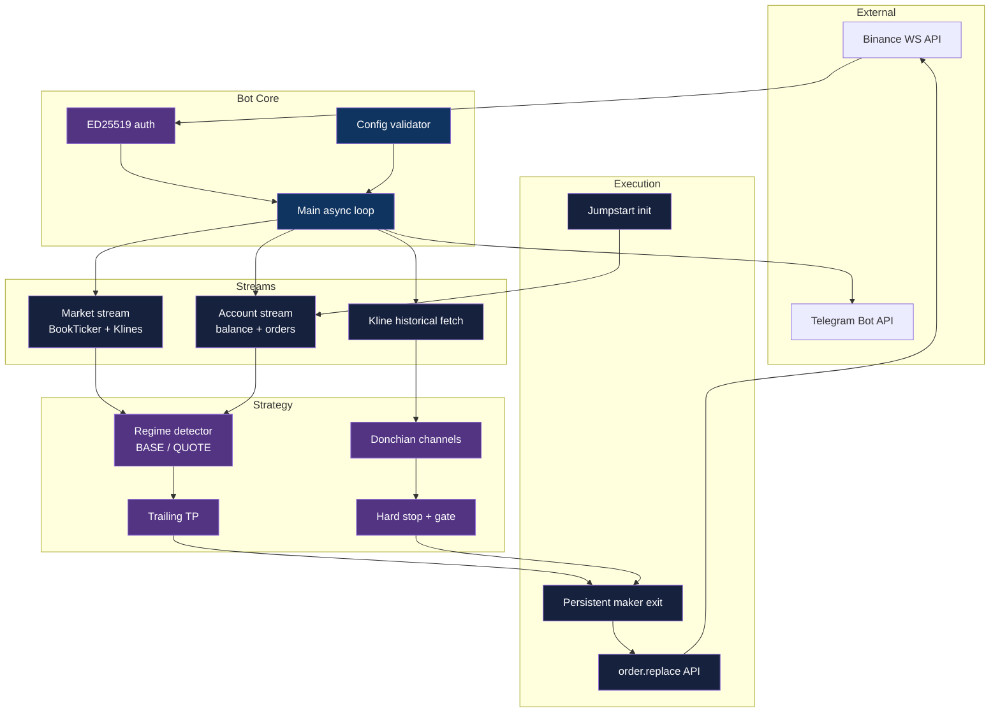
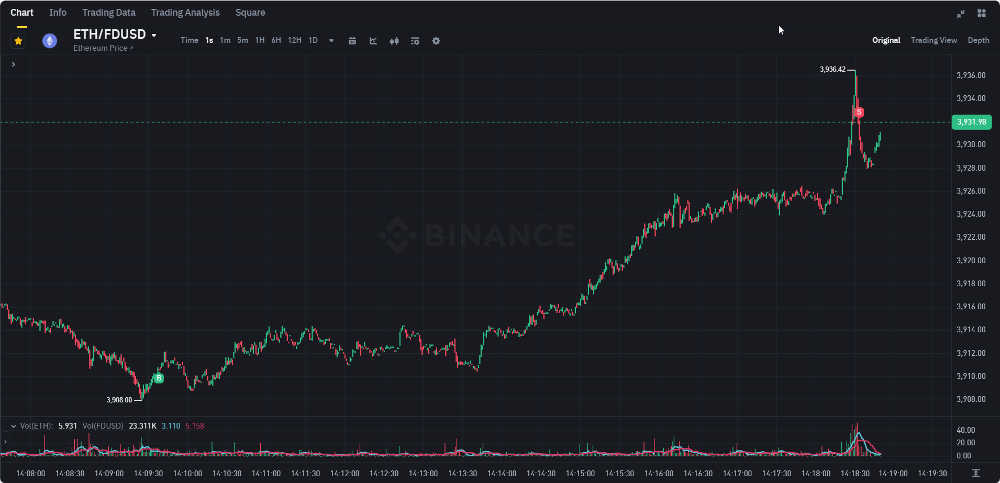
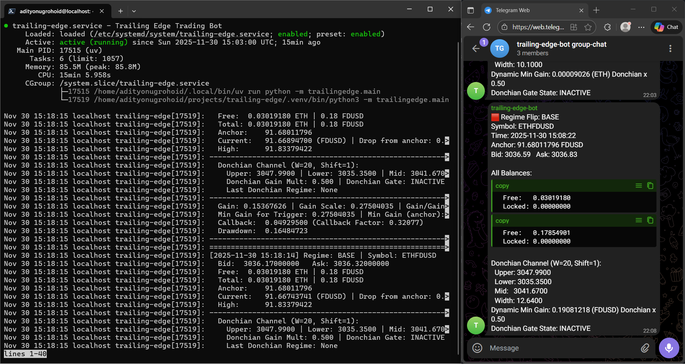

<div align="center">

# Trailing Edge

[](https://github.com/adityonugrohoid/trailing-edge/actions/workflows/ci.yml)
[](https://www.python.org/downloads/)
[](https://github.com/astral-sh/uv)
[](https://pre-commit.com/)
[](LICENSE)
[](#)

**Async Binance trading bot — dynamic trailing take-profit, regime detection, Donchian-channel gating, ED25519 auth, systemd-deployed for 24/7 operation, with Telegram alerts.**

[Getting Started](#getting-started) | [Architecture](#architecture) | [Strategy](#strategy) | [Deployment](#deployment) | [Notable Code](#notable-code)

</div>

---

> **Risk disclaimer:** trading cryptocurrencies carries significant risk of loss. This project is provided for educational and research purposes. Use at your own risk — the author accepts no responsibility for financial outcomes.

## Table of Contents

- [Features](#features)
- [Tech Stack](#tech-stack)
- [Architecture](#architecture)
- [Demo](#demo)
- [Strategy](#strategy)
- [Getting Started](#getting-started)
- [Usage](#usage)
- [Deployment](#deployment)
- [How It Works](#how-it-works)
- [Project Structure](#project-structure)
- [Notable Code](#notable-code)
- [Architectural Decisions](#architectural-decisions)
- [Testing](#testing)
- [Roadmap](#roadmap)
- [License](#license)
- [Author](#author)

## Features

- **Async event loop** — `asyncio` + `websockets` handles market data, account, and order streams concurrently on one core
- **Dynamic trailing take-profit** — exponential decay from `START_FACTOR` to `MIN_FACTOR`, locks in gains while leaving room for upside
- **Regime auto-switch** — moves between `BASE` (inventory) and `QUOTE` (cash) modes based on balance state, with all-in compounding
- **Hard stop with Donchian gating** — channel-based stop with smart re-entry: gate opens only when price crosses mid-channel in the favorable direction
- **Persistent maker exits** — uses Binance's native `order.replace` to chase best bid/ask with the same `clientOrderId` (no order spam)
- **Jumpstart balance init** — places deep out-of-market orders to trigger user-data-stream balance snapshots, solving the cold-start problem
- **WebSocket reconciliation** — stateless operation, rebuilds state from event streams on reconnect; no database needed
- **ED25519 logon auth** — non-expiring asymmetric signing, no shared secret on the wire
- **Production deployment** — `systemd` service with auto-restart, journald logging, and resource limits
- **Telegram alerts** — broadcasts regime flips, fills, and critical events to one or more chats

## Tech Stack

| Component | Technology |
|-----------|------------|
| Language | Python 3.10+ |
| Runtime | `asyncio` event loop, single core |
| Package manager | `uv` |
| WebSocket | `websockets` |
| Crypto | `cryptography` (ED25519 signing) |
| Data | `numpy`, `pandas` |
| Lint / format | `ruff`, `mypy` |
| Hooks | `pre-commit` |
| Tests | `pytest`, `pytest-asyncio`, `pytest-cov` |
| Deployment | `systemd` + `journald` |
| Notifications | Telegram Bot API |

## Architecture


```mermaid
graph TD
    subgraph "External"
        BINANCE["Binance WS API"]
        TELEGRAM["Telegram Bot API"]
    end

    subgraph "Bot Core"
        MAIN["Main async loop"]
        AUTH["ED25519 auth"]
        CFG["Config validator"]
    end

    subgraph "Streams"
        WSMD["Market stream<br/>BookTicker + Klines"]
        WSAC["Account stream<br/>balance + orders"]
        KLINE["Kline historical fetch"]
    end

    subgraph "Strategy"
        REGIME["Regime detector<br/>BASE / QUOTE"]
        DONCHIAN["Donchian channels"]
        TRAIL["Trailing TP"]
        STOP["Hard stop + gate"]
    end

    subgraph "Execution"
        MAKER["Persistent maker exit"]
        REPLACE["order.replace API"]
        JUMP["Jumpstart init"]
    end

    BINANCE --> AUTH --> MAIN
    CFG --> MAIN
    MAIN --> WSMD
    MAIN --> WSAC
    MAIN --> KLINE
    WSMD --> REGIME
    WSAC --> REGIME
    KLINE --> DONCHIAN
    REGIME --> TRAIL
    DONCHIAN --> STOP
    TRAIL --> MAKER
    STOP --> MAKER
    MAKER --> REPLACE
    REPLACE --> BINANCE
    JUMP --> WSAC
    MAIN --> TELEGRAM

    style MAIN fill:#0f3460,color:#fff
    style AUTH fill:#533483,color:#fff
    style CFG fill:#0f3460,color:#fff
    style WSMD fill:#16213e,color:#fff
    style WSAC fill:#16213e,color:#fff
    style KLINE fill:#16213e,color:#fff
    style REGIME fill:#533483,color:#fff
    style DONCHIAN fill:#533483,color:#fff
    style TRAIL fill:#533483,color:#fff
    style STOP fill:#533483,color:#fff
    style MAKER fill:#16213e,color:#fff
    style REPLACE fill:#16213e,color:#fff
    style JUMP fill:#16213e,color:#fff
```

## Demo

### Strategy chart



### Live deployment — systemd + Telegram



The bot runs unattended on a cloud VPS. `systemd` handles auto-start, restart-on-crash, and resource limits; Telegram surfaces fills, regime flips, and critical errors in real time.

## Strategy

### 1. Regime detection

The bot tracks balance state and switches modes:

| State | Hold | Behavior |
|-------|------|----------|
| `BASE` | Inventory (e.g. ETH) | Persistent maker SELL — exits to cash on profit target or hard stop |
| `QUOTE` | Cash (e.g. FDUSD) | Persistent maker BUY — re-enters when channel gate opens |

State updates are pushed via the Binance user-data stream — no polling, no DB.

### 2. Trailing take-profit

```python
# Exponential decay from START_FACTOR to MIN_FACTOR as gain grows
factor = MIN_FACTOR + (START_FACTOR - MIN_FACTOR) * exp(-decay * gain_pct)
trailing_stop = peak_price * (1 - factor)
```

Profit-take widens early and tightens as gains compound — locks in upside while keeping room for continued runs.

### 3. Donchian-gated hard stop

When the trailing stop fires, the bot doesn't immediately re-enter. The Donchian channel acts as a re-entry gate:

- After a `BASE → QUOTE` exit (sold inventory): wait for price to **rise above mid-channel** before re-entering.
- After a `QUOTE → pause`: wait for price to **fall below mid-channel** before re-entering.

This avoids whipsaw re-entries during the same volatility burst.

### 4. Min-gain logic

The minimum acceptable profit per round-trip is the **strictest** of three constraints:

| Component | Purpose |
|-----------|---------|
| Static fraction | User-set floor (e.g. 0.1%) |
| Fee + buffer | Symbol-specific fee structure (supports 0% maker pairs) |
| Donchian multiplier | Scales with channel width for volatility |

## Getting Started

### Prerequisites

- Python 3.10+
- `uv` — see [install instructions](https://docs.astral.sh/uv/getting-started/installation/)
- Binance account with **ED25519** API keys (Account → API Management → Edit → ED25519)
- (Optional) Telegram bot + chat IDs for notifications

### Installation

```bash
git clone https://github.com/adityonugrohoid/trailing-edge.git
cd trailing-edge
uv sync
```

### Configuration

```bash
cp .env.example .env
# Edit .env — see table below
```

| Variable | Required | Purpose |
|----------|----------|---------|
| `BINANCE_ED25519_API_KEY` | Yes | Binance API key (ED25519 type) |
| `BINANCE_ED25519_PRIV_PATH` | Yes | Path to ED25519 private-key PEM (e.g. `secrets/ed25519-priv.pem`) |
| `TELEGRAM_BOT_TOKEN` | No | Bot token for notifications |
| `TELEGRAM_CHAT_ID` | No | Personal chat ID |
| `TELEGRAM_GROUP_CHAT_ID_1` | No | Optional group broadcast |
| `TELEGRAM_GROUP_CHAT_ID_2` | No | Optional group broadcast |

Place ED25519 keys in `secrets/` (already gitignored):

```
secrets/
├── ed25519-priv.pem
└── ed25519-pub.pem
```

Trading parameters live in `src/trailingedge/config.py` — `SYMBOL`, `MIN_QTY`, `LOT_SIZE`, `START_FACTOR`, `MIN_FACTOR`, Donchian `WINDOW`/`SHIFT`/`GAIN_MULTIPLIER`, fee/buffer settings.

## Usage

```bash
# Run the bot
uv run trailing-edge

# Stop with Ctrl-C (graceful shutdown)
# Or hotkey: type 'x' + Enter for operator-triggered exit
```

On startup the bot:

1. Validates configuration (fail-fast on bad credentials or missing PEM)
2. Authenticates to Binance WS via ED25519 logon
3. Fetches historical klines and seeds Donchian baselines
4. Subscribes to market and account streams
5. Places jumpstart orders to seed the balance snapshot, then cancels
6. Enters the main async loop

## Deployment

### systemd (Linux VPS)

```ini
# /etc/systemd/system/trailing-edge.service
[Unit]
Description=Trailing Edge Trading Bot
After=network-online.target
Wants=network-online.target

[Service]
Type=simple
User=your-username
WorkingDirectory=/path/to/trailing-edge
EnvironmentFile=/path/to/trailing-edge/.env
ExecStart=/home/your-username/.local/bin/uv run python -m trailingedge.main
Restart=always
RestartSec=10
StandardOutput=journal
StandardError=journal

[Install]
WantedBy=multi-user.target
```

```bash
sudo systemctl daemon-reload
sudo systemctl enable --now trailing-edge.service

# Live logs
sudo journalctl -u trailing-edge.service -f
```

## How It Works

### 1. Async loop, single core

A single `asyncio` event loop handles three concurrent WebSocket streams (market, account, kline) plus the main strategy tick. No threading, no race conditions, sub-100ms reaction time on commodity hardware.

### 2. WebSocket reconciliation, not DB

State (balances, open orders, last fill) is reconstructed entirely from stream events. On reconnect, the bot re-subscribes and Binance pushes a fresh snapshot — no SQL, no migrations, no consistency window.

### 3. Persistent maker exit

When the strategy decides to exit, the bot places a post-only maker order with a stable `clientOrderId`. On every tick where the best bid/ask moves, it issues `order.replace` against the same ID — chases the price aggressively without spawning new orders.

### 4. Jumpstart balance init

Binance's user-data stream only pushes balance updates on *change*. To seed the initial snapshot without a REST call, the bot places a tiny order ±10% from spot, which trips a balance-update event, then immediately cancels.

## Project Structure

```
trailing-edge/
├── src/trailingedge/
│   ├── auth/
│   │   └── manager.py             # ED25519 logon + signature
│   ├── websocket/
│   │   ├── account.py             # User-data subscription
│   │   ├── account_stream.py      # Balance update parser
│   │   ├── market_fetch.py        # Historical kline fetch
│   │   ├── market_stream.py       # BookTicker + Kline streams
│   │   └── orders.py              # Place / cancel / replace
│   ├── indicators/
│   │   ├── donchian.py            # Active — gating + breakout
│   │   └── atr.py                 # Implemented but currently passive
│   ├── notifications/
│   │   └── telegram.py            # Multi-target broadcast
│   ├── config.py                  # Trading parameters
│   ├── config_validator.py        # Startup validation
│   ├── logging_config.py          # Session-timestamped logs
│   └── main.py                    # Entry point + main async loop
├── tests/
│   ├── test_main_logic.py
│   ├── test_state_transitions.py
│   ├── test_websocket_reconnection.py
│   ├── auth/test_manager.py
│   ├── websocket/test_market_fetch.py, test_orders.py
│   └── notifications/test_telegram_failures.py
├── docs/images/                   # Strategy + deployment screenshots
├── .github/                       # CI workflow
├── .pre-commit-config.yaml
├── .env.example
├── pyproject.toml
└── NOTABLE_CODE.md
```

## Notable Code

> See [NOTABLE_CODE.md](NOTABLE_CODE.md) for annotated walk-throughs of the async trading loop, WebSocket reconciliation pattern, ED25519 auth flow, and the systemd deployment configuration.

## Architectural Decisions

### 1. `asyncio` over threading

**Decision:** Single-core async event loop, no thread pool.

**Reasoning:** The workload is I/O-bound (WebSocket frames). Threads add context-switch overhead and race-condition risk. `asyncio` handles three concurrent streams + strategy on one core with sub-100ms reaction time and zero locking.

### 2. `systemd` over Docker

**Decision:** Native systemd unit on VPS, no container.

**Reasoning:** For a single-node bot, Docker adds bridge-networking overhead and a non-trivial persistence story. systemd gives `Restart=always` for crash recovery, native journald log rotation without sidecars, and cgroup-based resource limits — all without an extra runtime.

### 3. ED25519 over HMAC

**Decision:** Asymmetric ED25519 logon, no HMAC-signed REST.

**Reasoning:** No shared secret on the wire; if the API key leaks, the attacker can't forge requests without the private PEM. Rotation is non-disruptive (publish a new public key, swap the PEM). Cost is one extra setup step.

### 4. In-memory state, WebSocket reconciliation

**Decision:** No database, no checkpointing — state lives in memory and rebuilds from streams on reconnect.

**Reasoning:** DB writes add latency and a consistency surface. The Binance user-data stream pushes a fresh snapshot on subscribe, so reconnection *is* the reconciliation. Trade-off: no historical analysis from local data — that's an explicit non-goal.

## Testing

```bash
uv run pytest                           # All tests
uv run pytest --cov=trailingedge        # With coverage
uv run pytest tests/test_main_logic.py -v
```

| Module | Coverage |
|--------|----------|
| `test_main_logic.py` | Trading loop happy path + edge cases |
| `test_state_transitions.py` | BASE ↔ QUOTE regime switches |
| `test_websocket_reconnection.py` | Reconnect + reconciliation |
| `auth/test_manager.py` | ED25519 signing |
| `websocket/test_market_fetch.py`, `test_orders.py` | Stream parsing, order construction |
| `notifications/test_telegram_failures.py` | Telegram error handling |

### Code quality

```bash
uv run ruff check .       # Lint
uv run ruff format .      # Format
uv run mypy .             # Type check (pragmatic — see pyproject)
pre-commit run --all-files
```

## Roadmap

- [x] Async architecture with concurrent WS streams
- [x] Trailing take-profit with exponential decay
- [x] Regime detection + auto-compounding
- [x] Donchian-gated hard stop
- [x] Persistent maker exit via `order.replace`
- [x] Jumpstart balance initialization
- [x] systemd deployment + Telegram alerts
- [ ] Activate ATR for adaptive position sizing
- [ ] Multi-symbol portfolio mode
- [ ] Optional REST fallback for reconnect storms

## License

MIT — see [LICENSE](LICENSE).

## Author

**Adityo Nugroho** ([@adityonugrohoid](https://github.com/adityonugrohoid))
